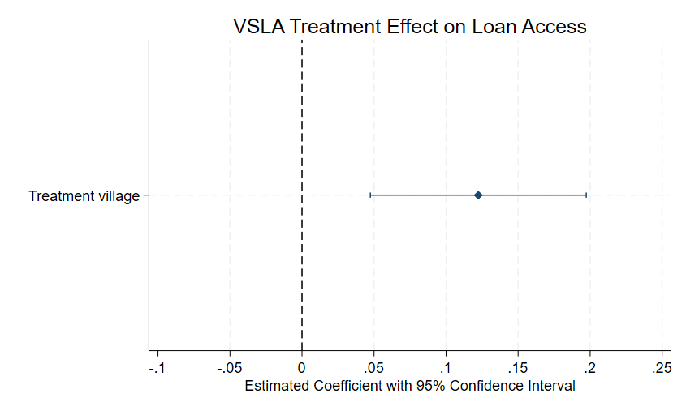
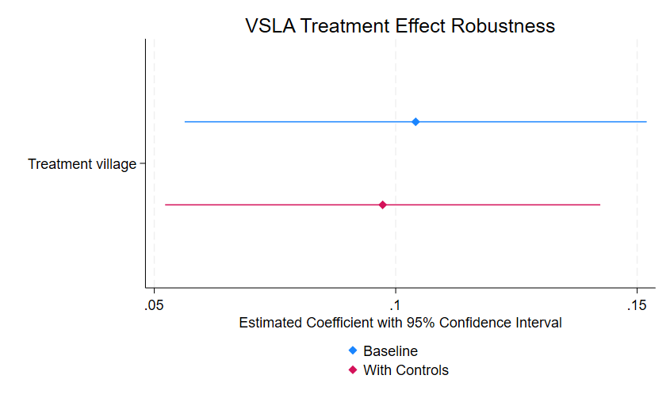

# VSLA Replication Project


## Overview

This project replicates selected empirical results from the paper:


**Impact of Village Savings and Loans Associations: Evidence from a Cluster Randomized Trial**


published in the *Journal of Development Economics (2016)*.


The project focuses on replicating treatment effect estimations using STATA and understanding the empirical workflow commonly used in development economics research.


---


## Research Question

Does participation in Village Savings and Loan Associations (VSLAs) improve access to loans and financial outcomes among rural households?


---


## Methodology

- Cluster Randomized Controlled Trial (RCT)

- Intention-to-Treat (ITT) estimation

- OLS regression

- Clustered standard errors

- Block fixed effects


---


## Data

- Household-level survey data

- Malawi

- Baseline and post-treatment observations


---


## Key Empirical Workflow

- Constructed reproducible research folder structure

- Loaded and inspected STATA datasets

- Generated transformed variables

- Conducted baseline balance checks

- Estimated treatment effects on loan access

- Interpreted causal inference results


---


## Preliminary Findings

The replication results suggest that participation in the VSLA treatment significantly increased access to loans.


Example result:


- Treatment coefficient: 0.122

- P-value: 0.002


Interpretation:

The treatment group experienced a statistically significant increase in loan access compared to the control group.


---


## Technical Skills Demonstrated

- STATA

- Applied econometrics

- Data cleaning

- Causal inference

- Clustered standard errors

- Empirical replication

- Research documentation


---


## Repository Structure

```
data/       -> raw datasets
dofiles/    -> STATA do-files
outputs/    -> regression outputs
graphs/     -> figures and visualizations
paper/      -> original research paper
reports/    -> replication reports
note/       -> replication notes and documentation


Next steps:

- Replicate additional treatment effect tables

- Export regression outputs

- Reproduce figures and tables

- Improve reproducibility workflow

```

## Treatment Effect Visualization

The figure below presents the estimated treatment effect of participation in Village Savings and Loan Associations (VSLAs) on household loan access.



## Robustness Analysis

To assess the robustness of the treatment effect, additional household-level controls were included in the regression specification, including:

- Household head age
- Household head education
- Female-headed household indicator

The estimated treatment coefficient remained positive and statistically significant after including controls, suggesting that participation in Village Savings and Loan Associations (VSLAs) improves household access to loans.

The treatment effect decreased slightly from approximately 0.104 to 0.097, indicating that the main findings are relatively stable across model specifications.

This robustness exercise demonstrates basic applied microeconometric workflow commonly used in development economics research.


## Replication Findings

The replication results suggest that participation in Village Savings and Loan Associations (VSLAs) has a positive effect on household access to loans.

Across specifications, the treatment effect remained statistically significant at the 1% level, with estimated coefficients ranging from approximately 0.097 to 0.104.

The robustness analysis indicates that the estimated treatment effect is relatively stable after controlling for observable household characteristics such as age, education, and female household headship.

These findings are broadly consistent with the original paper’s argument that community-based financial institutions can improve financial inclusion among rural households.
